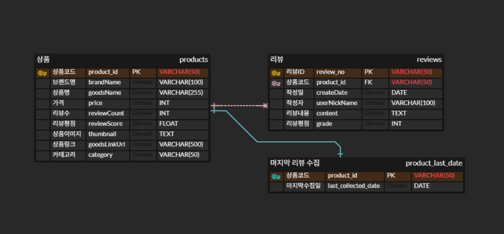
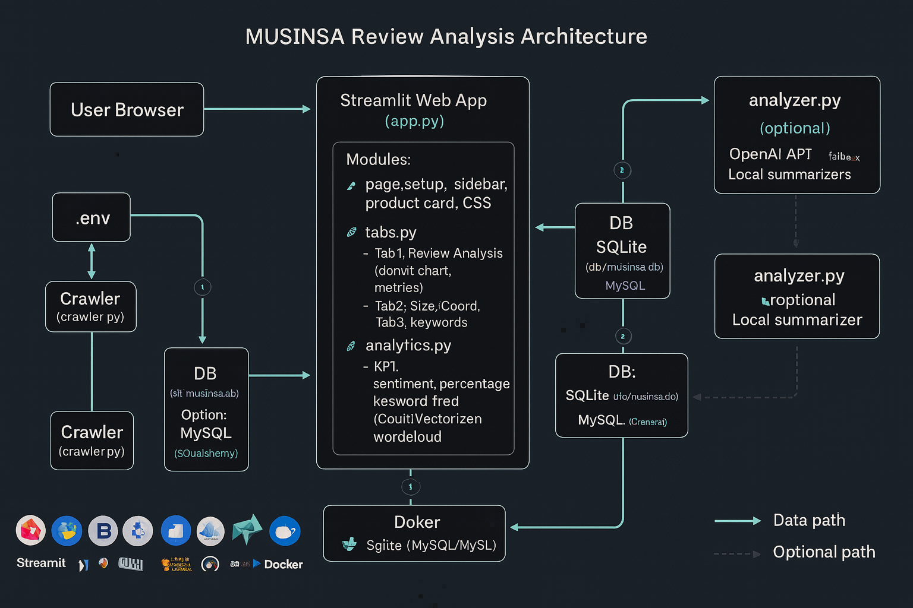
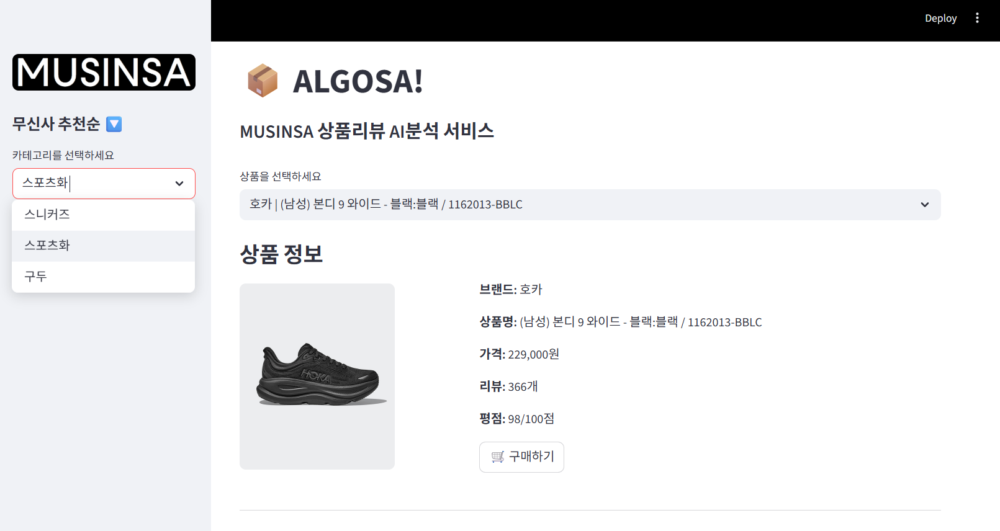
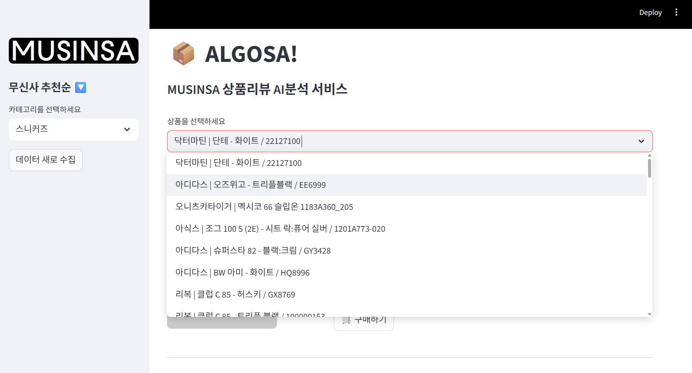
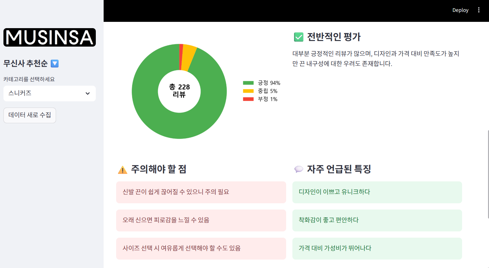
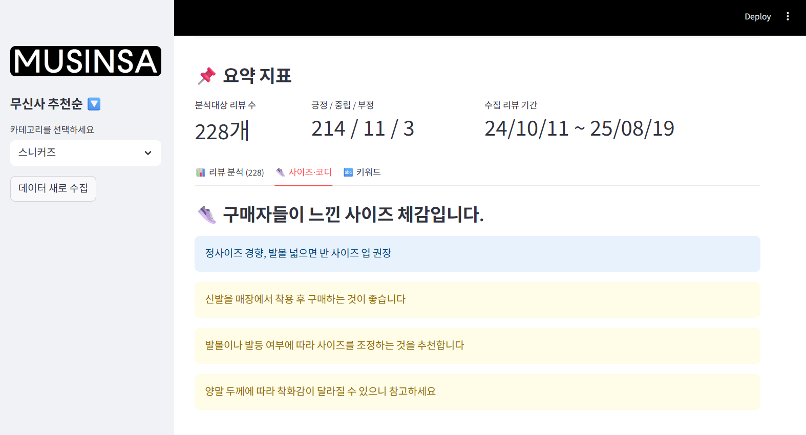
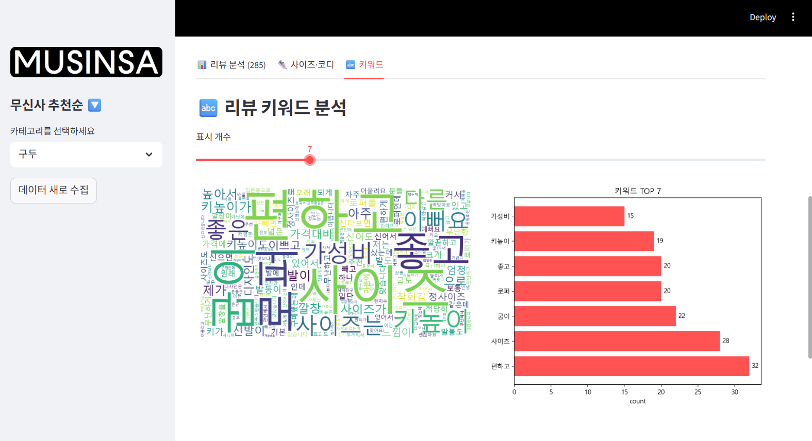

# 무신사 상품 리뷰 AI 분석 프로젝트: ALGOSA

## 📖 1. 프로젝트 소개
본 프로젝트는 **무신사(MUSINSA)** 상품 품목 및 리뷰 데이터를 수집하고, AI를 기반으로 **Streamlit**에서 시각적으로 분석할 수 있도록 만든 웹 대시보드입니다. 사용자는 상품리뷰 전부를 확인하지 않아도 수많은 리뷰 데이터를 수집하고, 긍정/부정/중립으로 분류하고, 핵심 키워드를 추출하여 사이즈 및 코디 추천과 상품의 특성을 한 눈에 파악할 수 있습니다.

---

## 🚀 2. 주요 기능
-  **상품 리뷰 데이터 수집**  
  무신사 상품별 리뷰 데이터를 실시간 수집 및 저장  
-  **AI 기반 감정 분석**  
  수집된 리뷰 텍스트를 OpenAI API를 활용하여 긍정/부정/중립으로 분류하고, 총평을 요약
-  **사이즈 & 코디 분석**  
  구매자들의 체감 사이즈와 코디 추천 요약  
-  **키워드 분석**  
  WordCloud + TOP 키워드 BarChart 제공  
-  **시각화 대시보드**  
  분석된 데이터를 사용자 친화적인 웹 대시보드 형태로 제공

---

## 🛠️ 3. 기술 스택

| 구분            | 사용 기술                                                                 |
|-----------------|--------------------------------------------------------------------------|
| **Backend**     |  |
| **Frontend**    |  |
| **Database**    |   |
| **Data Processing** |     |
| **Visualization**   |   |
| **Infra**       |   |

---

## 🏛️ 4. 아키텍처 및 db설계

### ERD 구조

### 아키텍처 구조 (추후 변경예정)

## 🖥️ 5. 실행화면

### 1) 메인화면

### 2) 상품 선택

### 3) 감정 분석 및 리뷰를 기반한 전반적인 상품 평가

### 4) AI 리뷰기반 사이즈 추천 및 코디 추천

### 5) 워드클라우드 시각화 및 키워드

